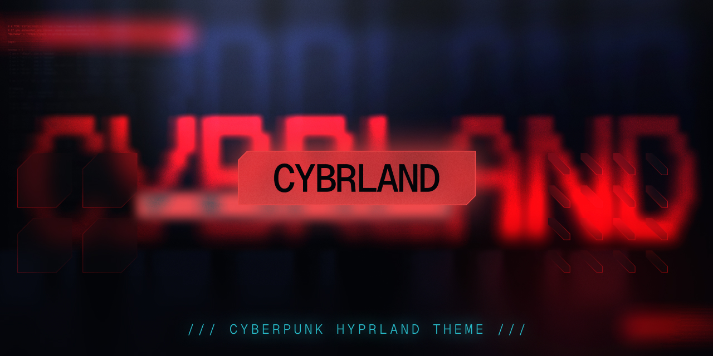
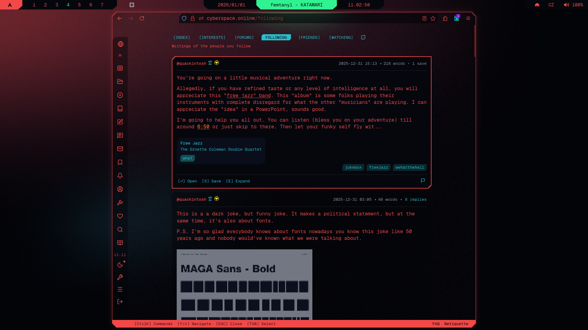
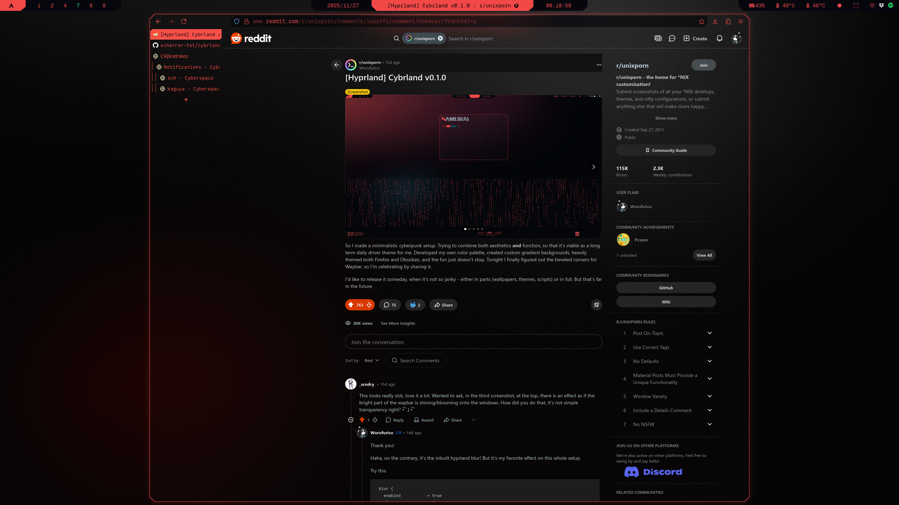
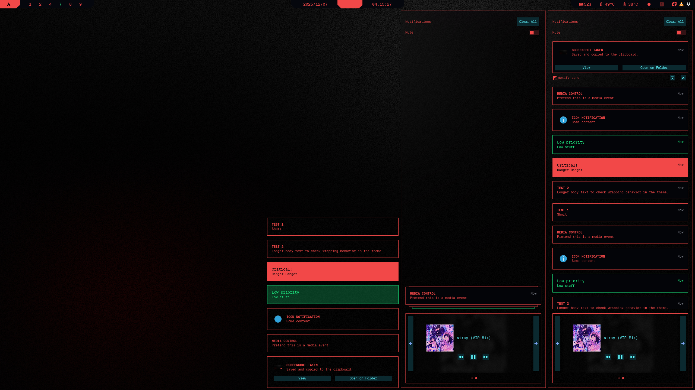

  

# Cybrland
> [!NOTE]
> **Cyberpunk design system**  
> Daily driven on Arch + Hyprland, individual themes work anywhere  
> 
> **Version:** v1.1.3  
> **Status:** Stable (2026-03-22)  

 &nbsp; 

 &nbsp;  &nbsp; 

## Content
- [What's Inside](#whats-inside)
- [Showcase](#showcase)
- [Themes](#themes)
- [Related Projects](#related-projects)
- [Credits & Inspiration](#credits--inspiration)

## What's Inside
- **Unified aesthetic** - Custom cyberpunk palette ([Cybrcolors](https://github.com/scherrer-txt/cybrcolors)) + 9 hand-crafted wallpapers ([Cybrpapers](https://github.com/scherrer-txt/cybrpapers))  
- **Theme collection** - Custom themes for 17+ applications (*more soon!*)  
- **Terminal-centric workflow** - Fast, integrated TUI/CLI tools  
- **Modular by design** - Use the full setup or cherry-pick individual themes  
- **Beginner-friendly docs** - Step-by-step guides with explanations + advanced patterns for power users  

## Showcase

  <em>Left-to-right: Neovim, rofi-launcher, cava, fastfetch, custom script ↗</em>

 

  <em>Left-to-right: stacked micro, yazi, broot ↗</em>

 

  <em>Firefox w/Cybrspace.online custom theme ↗</em>

 

  <em>Left-to-right: clock, btop, ls ↗</em>

 

  <em>Fore-to-back: wallpaper selector, neovim, matrix ↗</em>

 

  <em>Firefox w/Sidebery ↗</em>

  <em>swaync ↗ (floating notifications; control center; control center list)</em>

## Themes
### Core System
- **[hyprland](./hypr/readme.md)** - Tiling window manager
- **[kitty](./kitty/readme.md)** - Terminal emulator
- **[fish](./fish/readme.md)** - User-friendly shell
- **[waybar](./waybar/readme.md)** - Status bar with custom modules
- **[rofi](./rofi/readme.md)** - Application launcher & menus
- **[swaync](./swaync/readme.md)** - Notification daemon
- **[starship](./starship/readme.md)** - Cross-shell prompt

### Utilities
- **[btop](./btop/readme.md)** - TUI System resource monitor
- **[yazi](./yazi/readme.md)** - TUI Terminal file manager
- **[broot](./broot/readme.md)** - CLI Directory navigator
- **[fzf](./fzf/readme.md)** - CLI Fuzzy finder
- **[micro](./micro/readme.md)** - TUI Lightweight text editor
- **[cava](./cava/readme.md)** - CLI Audio visualizer
- **[bat](./bat/readme.md)** - CLI Syntax-highlighted file viewer 
- **[fastfetch](./fastfetch/readme.md)** - CLI System information tool  
- **[newsboat](./newsboat/readme.md)** - CLI RSS/Atom reader

### WIP
- **[neovim](./nvim/readme.md)** - Fully themed, polishing  
- **[firefox](./firefox/readme.md)** - Fully themed, major refactor planned  
- **[gtk](./gtk/readme.md)** - Early stage  
- **Cybrcursors** - Fully themed, polishing (*Unreleased*)  
- **VSCode** - Partially themed (*Unreleased*)  
- **Obsidian** - Standalone theme planned (*Unreleased*)  

## Related Projects
These can be used independently of Cybrland:  
- [Cybrcolors](https://github.com/scherrer-txt/cybrcolors) - Custom color palette (*foundation for all themes*)
- [Cybrpapers](https://github.com/scherrer-txt/cybrpapers) - Hand-crafted wallpaper collection
- Cybrcursors - Custom mouse cursors ([preview](https://8upload.com/image/d91ecbad191c4ec9/image_3.jpg))

## Credits & Inspiration
This project builds on the work of many talented creators:

**Dotfile foundations:**
- [Matt-FTW/dotfiles](https://github.com/Matt-FTW/dotfiles) - Many of Hyprland configs (*keybinds, scripts*) are based on their dotfiles  

**Theming & aesthetics:**
- [Catppuccin](https://github.com/catppuccin/catppuccin) - This project showed me what's possible with themes, it's overall scope is inspiration and aspiration at the same time
- [Cyberpunk 2077 UI Bible](https://www.behance.net/gallery/118663901/Cyberpunk-2077User-Interface-(Part-1)) - Endless source of inspiration and ideas (s/o [Vladimír Vilimovský](https://www.behance.net/vladimirvilimovsky), [Jakub Knapik](https://www.linkedin.com/in/jakub-knapik-56741931), [Robert Bielecki](http://robertbielecki.com/), [Imanol Delago Salazar](https://www.artstation.com/artwork/WKzrBG), [Marcin Stepien](https://www.artstation.com/artwork/GaVGaz), [Simon Besombes](https://www.artstation.com/artwork/285r4a), [Kamil Piotrowski](https://www.artstation.com/artwork/285lYa), [Zuzanna Dabrowa](https://www.artstation.com/artwork/d8RnZ1), [Wojciech Chalinski](https://www.artstation.com/artwork/2855DY), [Pawel Matuszak](https://www.artstation.com/artwork/NxeNDN), [Mateusz Walus](https://www.artstation.com/artwork/5X4OLO) and the army of unnamed and uncredited from CD Projekt RED, who made Cyberpunk 2077 possible)
- tonsky's [Minimalist Syntax Highlight philosophy](https://tonsky.me/blog/syntax-highlighting/) - This is what I think is optimal and ideal syntax highlighting; inspiration for upcoming system-wide highlighting unification

**Community:**
- [r/unixporn](https://reddit.com/r/unixporn) - Their [feedback](https://www.reddit.com/r/unixporn/comments/1ouzvfy/hyprland_cybrland_v010/) was the biggest impulse for me to release the dotfiles.
- [Cyberspace.online](https://cyberspace.online) - Absolutely great community where I found my digital home after many years of wandering and lurking. Their support was of immensely important to keep me going.

If I missed anyone, feel free to open an issue!
