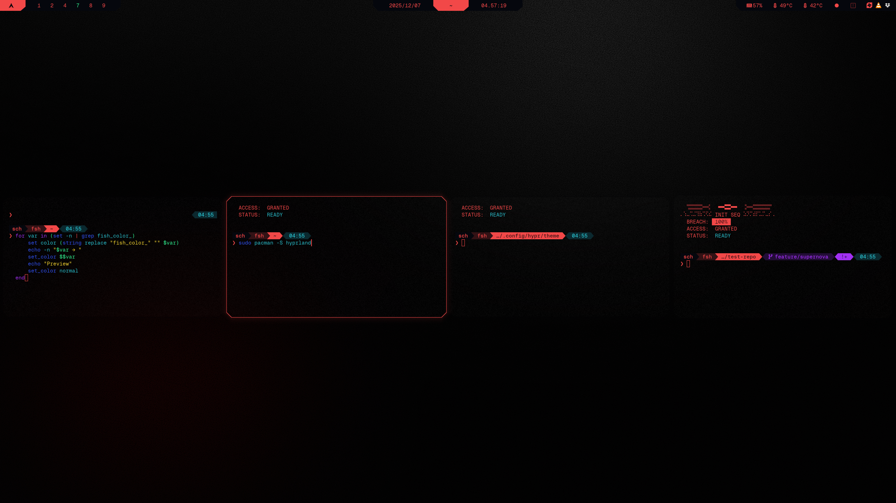

# Cybrland
A complete design system and dotfile setup for Hyprland, inspired by cyberpunk aesthetics.

---

## Project Info

> [!CAUTION]
**Status:** Work in progress  
**Current version:** v0.8.0  
**Target stable release:** **v1.0.0 on 2025-12-31**

> [!WARNING]
This project is **not yet stable**.  
Expect breaking changes, missing features, and occasional chaos.  
Please avoid sharing publicly until the 1.0.0 release.

### Related projects
- **[Cybrpapers](https://github.com/scherrer-txt/cybrpapers)** -- hand-crafted cyberpunk wallpapers  
- **[Cybrcolors](https://github.com/scherrer-txt/cybrcolors)** -- unified color palette used across all themes

# Showcase
<p align="left">
  
</p>
<p align="center">
  <em>Waybar, Hyprland, Kitty, Starship ↗</em>
</p>
<br>
<p align="left">
  
</p>
<p align="center">
  <em>Firefox ↗</em>
</p>
<br>
<p align="left">
  
</p>
<p align="center">
  <em>btop ↗</em>
</p>
<br>
<p align="left">
  
</p>
<p align="center">
  <em>rofi ↗ (launcher, clipboard, emoji, powermenu, screenshot menu, wallpaper menu)</em>
</p>
<br>
<p align="left">
  
</p>
<p align="center">
  <em>swaync ↗ (floating notifications; control center; control center list)</em>
</p>
<br>
<p align="left">
  
</p>
<p align="center">
  <em>Hyprlock ↗</em>
</p>


## Current Status

| Component   | State | Notes | Last Update |
|------------|--------|-------------------------------|---|
| Starship   | 🟢 Done | Fully themed | 2025-12-07 |
| swaync     | 🟢 Done | Fully themed | 2025-12-07 |
| broot      | 🟢 Done | Fully themed | 2025-12-07 |
| fzf        | 🟢 Done | Fully themed | 2025-12-07 |
| Kitty      | 🟢 Done | Fully themed | 2025-12-07 |
| Fish       | 🟢 Done | Fully themed | 2025-12-07 |
| yazi       | 🟢 Done | Fully themed | 2025-12-07 |
| Rofi       | 🟢 Done | Fully themed | 2025-12-07 |
| Micro      | 🟢 Done | Fully themed | 2025-12-02 |
| Waybar     | 🟢 Done | Fully themed | 2025-11-23 |
| Cava       | 🟢 Done | Fully themed | 2025-11-14 |
| btop       | 🟢 Done | Fully themed | 2025-11-14 |
| nvtop      | 🟢 Done | Fully themed | 2025-11-14 |
| Hyprland   | 🟡 Beta | Fully themed; polishing | 2025-12-07 |
| Cybrcursors | 🔴 Alpha | Fully themed; polishing | 2025-12-07 |
| VSCode     | 🔴 Alpha | Basic theme; early stage | 2025-11-20 |
| Firefox    | 🔴 Alpha | Basic theme; refactoring | 2025-11-14 |
| Obsidian   | 🔴 Alpha | Plugin-based theme; true standalone theme planned | 2025-08-14 |
| Neovim     | ⚫ None | Planned theme | n/a |
| Spicetify  | ⚫ None | Planned theme | n/a |
| mpv  | ⚫ None | Planned theme | n/a |
| Color flavors | ⚫ None | Planned feature | n/a |

## Roadmap

### v1.0.0 (2025-12-31)
- [ ] **Extensive technical documentation**  
  Full breakdown of file structure, color tokens, theme philosophy, overrides, scripts, keybinds, and customization workflow to make the entire setup easy to use and extend for others.  
- [ ] Finalize Hyprland keybind system; add user guide for creating custom bindings  
- [ ] Firefox theme  
- [ ] VSCode theme  
- [ ] Neovim theme  
- [ ] Custom mouse cursors (working title: *Cybrcursors*)  
- [ ] Finish all themes listed as 🟡 Beta and 🔴 Alpha  

### v1.5.0 (early 2026)
- [ ] Standalone Obsidian theme (working title: *Cyberian*)  
- [ ] Add switchable color flavors
- [ ] Replace waybar/swaync/rofi with quickshell
- [ ] Replace rofi with Vicinae or Walker
- [ ] Spicetify theme  
- [ ] Vencord theme
- [ ] Additional wallpaper bundles (Cybrpapers expansion)

### v2.0.0 (mid 2026)
- [ ] Installer script?  
- [ ] GTK theme?  

---

# Themes
<div align="left">
  <a href="./waybar/about-waybar.md">
    
  </a>
  <a href="./kitty/about-kitty.md">
    
  </a>
  <a href="./micro/about-micro.md">
    
  </a>
  <a href="./cava/about-cava.md">
    
  </a>
  <a href="./btop/about-btop.md">
    
  </a>
  <a href="./rofi/about-rofi.md">
    
  </a>
  <a href="./hyprland/about-hyprland.md">
    
  </a>
  <a href="./starship/about-starship.md">
    
  </a>
  <a href="./firefox/about-firefox.md">
    
  </a>
</div>

# Installation & Pre-flight Guide
Before applying these dotfiles, follow this short pre-flight checklist to avoid configuration conflicts and ensure a smooth setup.

## 1. Backup your existing configs

It’s strongly recommended to back up your current configuration directories:

```sh
mkdir -p ~/.backup_configs
cp -r ~/.config/hypr ~/.backup_configs/hypr 2>/dev/null
cp -r ~/.config/kitty ~/.backup_configs/kitty 2>/dev/null
cp -r ~/.config/waybar ~/.backup_configs/waybar 2>/dev/null
cp -r ~/.config/rofi ~/.backup_configs/rofi 2>/dev/null
cp -r ~/.config/btop ~/.backup_configs/btop 2>/dev/null
```

This allows you to quickly revert if needed.

## 2. Install prerequisites

Make sure the following components are installed:
- `GeistMono Nerd Font` (download [from here](https://www.nerdfonts.com/font-downloads))
- hwmon (for waybar to display CPU, GPU and RAM)
- [rofi](https://github.com/davatorium/rofi) (launcher)
- [btop](https://github.com/aristocratos/btop) (CPU/RAM/Network resource monitor)
- [nvtop](https://github.com/Syllo/nvtop) (GPU resource monitor)
- [swaync](https://github.com/ErikReider/SwayNotificationCenter) (notifications)
- [topgrade](https://github.com/topgrade-rs/topgrade) (for upgrades)
- [pulseaudio](https://github.com/pulseaudio/pavucontrol) (to control audio)
- [PipeWire](https://archlinux.org/packages/extra/x86_64/pipewire/) (to control audio with keyboard wheel)
- Firefox
- [Sidebery](https://github.com/mbnuqw/sidebery) (vertical tabs extension for Firefox)

On Arch Linux:
```sh
sudo pacman -S otf-geist-mono-nerd
sudo pacman -S broot btop cava firefox fish fzf kitty lm_sensors micro nvtop obsidian rofi starship swaync waybar yazi
sudo sensors-detect
```

## 3. Optional: Test in a separate Hyprland profile

You can launch Hyprland with an alternate configuration without touching your main setup:
```sh
cp -r ~/.config/hypr ~/.config/hypr_test
Hyprland --config ~/.config/hypr_test/hyprland.conf
```

Useful for testing without affecting your main environment.

## 4. Check for hardcoded paths

Some paths might need adjustment depending on your system (e.g., wallpapers, scripts).

Run:
```sh
grep -R "~/" cybrland
grep -R "/home" cybrland
grep -R ".local/bin" cybrland
```

Update any paths as needed.

## 5. Review autostart services

These dotfiles may start components such as:
- wallpaper daemon
- idle/lock daemon
- notifications
- clipboard watcher
- Waybar
- Hyprpaper

Check that they don’t conflict with your existing services (e.g., swayidle, ags, systemd user services).

## 6. Commit a snapshot (if using Git-managed dotfiles)

If you version-control your dotfiles:
```sh
git add .
git commit -m "Snapshot before applying cybrland"
```

Makes rollback trivial.

## 7. Revert script (optional, recommended)

Create a simple revert script in case your system doesn’t boot into Hyprland cleanly:
```sh
#!/usr/bin/env bash
mv ~/.config/hypr ~/.config/hypr_bad
cp -r ~/.backup_configs/hypr ~/.config/hypr
```

Save it somewhere accessible (e.g., ~/.local/bin/revert-hypr).

## 8. After installation, test the essentials

Confirm that the following components work correctly:
- Waybar modules (CPU/GPU/network, clock, audio, brightness)
- Rofi launchers
- Kitty theming
- btop theme
- Keybinds (some may differ from your existing setup)
- Wallpaper rotation daemon
- Idle lock functionality
- Hardware monitoring